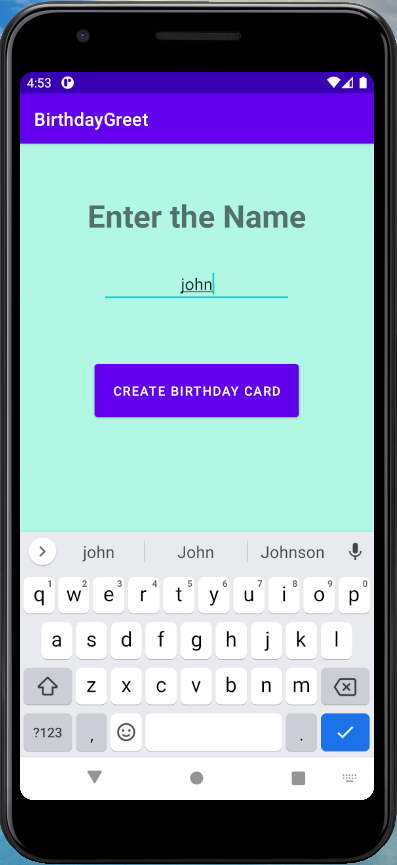
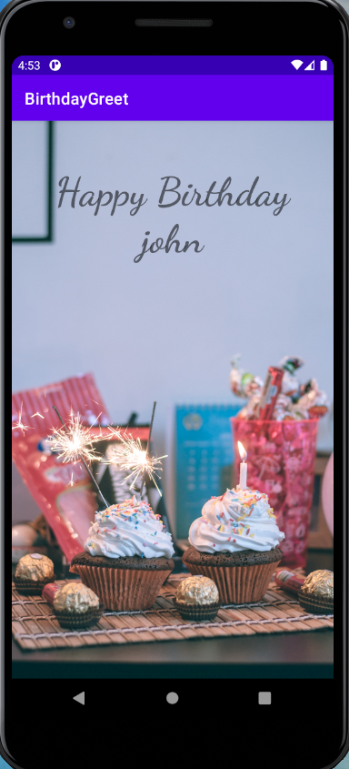

# Birthday-Greet
An Android App to wish your friends Happy Birthday! 
It is an multi screen user input based project.

### Description
- The Birthday-Greet app is made using kotlin. 
- It can be used to wish your friends Happy Birthday! 
- Multi activity UI, user input based app. 

## Use The App
-> Download the given APK file into your phone and start using it.
-> Have Fun !!

### Tools and Languages Used:

 

## Getting Started
-----------------------
1. Learn to code using kotlin 
2. Install Android Studio, if you don't already have it. 
3. Download the code from the given github repository. 
4. Import the code into Android Studio. 
5. Build and run the sample.  The user interface looks alike this: 

### Developed by:
<a href="https://github.com/sambit221">Sambit Kumar Tripathy</a>

